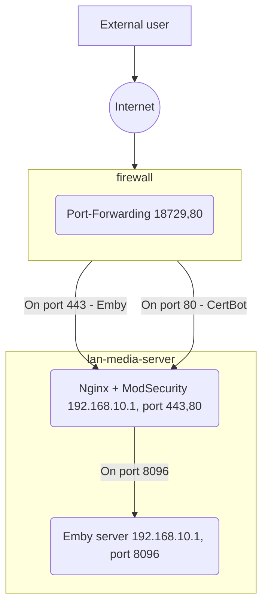

# Summary
This article explain how to setup a reverse proxy to expose your home Emby server to the internet with TLS and minimal WAF (Web Application Firewall).  
The articles assumes that:
- You run your Emby server on a Linux machine.
- Reverse proxy will run on the same machine as the Emby server 
- The machine has Docker installed

The article describes the usage of nginx and certbot containers.

# Configuration Steps
## 1. DNS
Set up a Domain Name that will point to your home router. If your home ISP (internet service provider) IP is not static, use one of the popular Dynamic DNS (DDNS) services, such as [DuckDNS](https://www.duckdns.org/). Dynamic DNS requires your router (or any other machine) to periodically reach out to the service to update your current IP address. Most of the time, it is either supported by your router/firewall, or you can run a script/app on your Emby server or another machine. Let's choose the name test.duckdns.org.


## 2. External Port
  - Choose a port number on which you want to expose Emby to the outside world. You can use random port [generators](https://it-tools.tech/random-port-generator). Here we use 18729.
  - Configure port forwarding on your firewall/router for the selected port to the reverse proxy IP and port. *This article assumes that the reverse proxy and Emby are on the same host.*
  - `Forward port 18729 to LAN IP 192.168.10.1, LAN Port 443`
  - Configure port forwarding on your firewall/router for port 80 to the reverse proxy IP and port 80. This port will be used for LetsEncrypt Domain validation.
  - `Forward port 80 to LAN IP 192.168.10.1, LAN Port 80` 
    
> Here your external URL for the Emby server will be: https://test.duckdns.org:18729

## 3. Reverse Proxy and TLS
This article uses the **nginx** container with ModSecurity (WAF module) - [owasp/modsecurity-crs](https://github.com/coreruleset/coreruleset)  

### 3.1 Scripts and configuration files
Create the following directory structure where you will store the nginx configuration and supporting scripts:  
```
$ ls -l /home/your-user/nginx-container-config
-rw-rw-r-- 1 your-user your-group    default.conf      # Main nginx configuration file
drwxr-xr-x 2 your-user your-group    www               # Directory with main static files (and the cert challenge /.well-known/acme-challenge/)
-rw-rw-r-- 1 your-user your-group    ├─ 50x.html       # This static page will be returned on 50x errors. You can customize it.
-rw-rw-r-- 1 your-user your-group    ├─ index.html     # You can customize and use this page for port 80 troubleshooting (will need to uncomment default.conf parts)
-rw-rw-r-- 1 your-user your-group    RESPONSE-999-EXCLUSION-RULES-AFTER-CRS.conf  # WAF OWASP Rules Adjustments for Emby

$ ls -l /home/your-user/
-rwxrwxr-- 1 your-user your-group    nginx-start.sh          # Docker run command
-rwxrwxr-- 1 your-user your-group    nginx-update.sh         # Docker image removal and latest image download
-rwxrwxr-- 1 your-user your-group    certbot-get-cert.sh     # First-time certificate request docker run command
-rwxrwxr-- 1 your-user your-group    certbot-update-cert.sh  # Certificate renewal docker run command
```
  
Create or download the files and customize the following parameters, as needed:
- [default.conf](./default.conf) - Nginx Reverse Proxy configuration
   - Emby IP address, port.
   - DNS name of the reverse proxy
- [RESPONSE-999-EXCLUSION-RULES-AFTER-CRS.conf](./RESPONSE-999-EXCLUSION-RULES-AFTER-CRS.conf) - WAF Rules exlusions for Emby Web UI
- 50x.html, index.html, ... - Customize as you want
- [nginx-start.sh](nginx-start.sh) - Script to start the nginx container
   - Volume mount paths
- [nginx-update.sh](nginx-update.sh) - Script to update the nginx container image
- [certbot-get-cert.sh](certbot-get-cert.sh) - CertBot - get LetsEncrypt TLS certificate for your DNS name
   - Volume mount paths
  - PUID - Your user's UID. Check the `id` command.
  - PGID - Your user's GID. Check the `id` command.
  - --email - Your valid email
  - -d - Your DNS name
- [certbot-update-cert.sh](certbot-get-cert.sh) - CertBot - get LetsEncrypt TLS certificate for your DNS name
   - Volume mount paths
  - PUID - Your user's UID. Check the `id` command.
  - PGID - Your user's GID. Check the `id` command.


### 3.2 How to run
Get the TLS certificate - `/home/your-user/certbot-get-cert.sh`. If successful, the directory structue will change to something like this:
```sh
$ tree /home/your-user/nginx-container-config
├── certbot-log
│   └── letsencrypt
├── error.log
├── letsencrypt
│   ├── accounts
│   │   └── acme-v02.api.letsencrypt.org
│   │       └── directory
│   │           └── 0a.....af
│   ├── archive
│   │   └── test.duckdns.org
               ...actual files...
│   ├── live
│   │   └── goodplace.duckdns.org
               cert.pem -> ../../archive/test.duckdns.org/cert1.pem
               chain.pem -> ../../archive/test.duckdns.org/chain1.pem
               fullchain.pem -> ../../archive/test.duckdns.org/fullchain1.pem
               privkey.pem -> ../../archive/test.duckdns.org/privkey1.pem
│   ├── renewal
└── www
```

Start the nginx container - `/home/your-user/nginx-start.sh`.   

### 3.3 Automation
**Start nginx on reboot - Cron**  
Edit the user cron file  `crontab -e` (make sure you can run the docker without sude), or the sudo cron file: `sudo crontab -e`.   
```sh
...
@reboot sleep 120 && /home/your-user/nginx-start.sh
...
```

**Renew TLS certificate - Cron**  
Edit the user cron file  `crontab -e` (make sure you can run the docker without sude), or the sudo cron file: `sudo crontab -e`.  
```sh
. . .
# Run certbot every monday to attempt LetsEncrypt nginx TLS cert renewal (will only be renewed if it's about to expire)
0 6 * * 1 /home/your-user/certbot-update-cert.sh
. . .
```
**Update nginx container image - 1. Cron**  
Edit the user cron file  `crontab -e` (make sure you can run the docker without sude), or the sudo cron file: `sudo crontab -e`. 
```sh
. . .
# Remove and re-download the latest nginx image
0 4 * * 1 /home/your-user/nginx-update.sh
. . .
```

**Update nginx container image - 2. Watchtower**  
Alternatively you can use the Watchtower to update your images: https://github.com/containrrr/watchtower  


### 3.2 How to troubleshoot
- Switch nginx WAF to monitoring mode: [nginx-start.sh](nginx-start.sh), `... -e MODSEC_RULE_ENGINE=DetectionOnly ...`
- Velidate nginx container logs and reasons for blocks/errors. `docker logs nginx`
