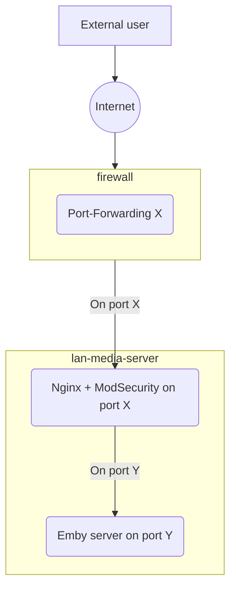

```mermaid
graph TD
  ext[External user]
 internet((Internet))

subgraph firewall
linkStyle default interpolate basis
   pf(Port-Forwarding X)
end
subgraph lan-media-server
linkStyle default interpolate basis
  proxy(Nginx + ModSecurity on port X)
  emby(Emby server on port Y)
end
 ext-->internet
 internet-->firewall
 firewall--->|On port X|proxy
 proxy--->|On port Y|emby
```
