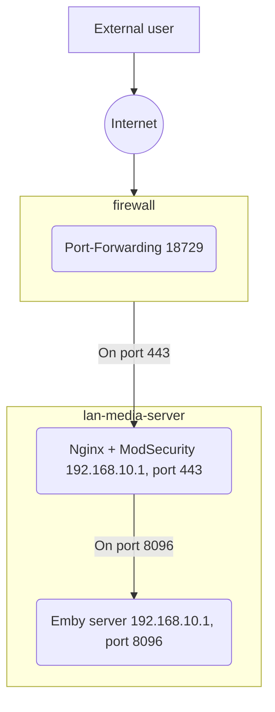

# Summary
This article explain how to setup a reverse proxy to expose your home Emby server to the internet with TLS and minimal WAF (Web Application Firewall).  
The articles assumes that:
- You run your Emby server on a Linux machine.
- Reverse proxy will run on the same machine as the Emby server 
- The machine has Docker installed

# Configuration Steps
## 1. DNS
Setup a Domain Name that will point to your home router. If your home ISP (internet provider) IP is not static, use one of the popular DynDNS (dynamic DNS) services, e.g. [DuckDNS](https://www.duckdns.org/). DynDNS requires your router (or any other machine) to periodically reach out to the service to update your current IP. Most of the time it is either supported by your router/firewall, or you can run a script/app on your emby server or another machine. Let's choose a name test.duckdns.org.
## 2. External Port
  - Choose a port number on which you want to expose Emby to the outside world. You canse use random port [generators](https://it-tools.tech/random-port-generator). Here we choose 18729.
  - Configure port forwarding on your firewall/router on the selected port to the reverse proxy IP and Port. *This article assumes that the reverse proxy and Emby are on the same host.*
  - `Forward port 18729 to LAN IP 192.168.10.1, LAN Port 443`
    
> Here your external URL for the Emby server will be: https://test.duckdns.org:18729

## 3. Reverse Proxy
This article uses the **nginx** container with ModSecurity (WAF module) pre-installed - [owasp/modsecurity-crs](https://github.com/coreruleset/coreruleset)  

### 3.1 Reverse proxy configuration
Create the following directory structure. This is where you will store the nginx configuration:  
```
$ ls -l /home/your-user/nginx-container-config
-rw-rw-r-- 1 your-user your-group   5 default.conf      # Main nginx configuration file
drwxr-xr-x 2 your-user your-group   4 www               # Directory with main static files (and the cert challenge /.well-known/acme-challenge/)
-rw-rw-r-- 1 your-user your-group   3    50x.html       # This static page will be returned on 50x errors. You can customize it.
-rw-rw-r-- 1 your-user your-group   3    index.html     # You can customize and use this page for port 80 testing
-rw-rw-r-- 1 your-user your-group   4 RESPONSE-999-EXCLUSION-RULES-AFTER-CRS.conf  # WAF OWASP Rules Adjustments for Emby
```
  
Create the main configuration file **default.conf**:
default.conf
```sh
# Nginx configuration for both HTTP and HTTPS

server_tokens off;

map $http_upgrade $connection_upgrade {
    default upgrade;
    '' close;
}

# What reverse proxy will return on http://192.168.10.1:80
server {
    listen *:80 default_server;

    server_name test.duckdns.org;
    set $always_redirect off;

    # This section will be used for automatic TLS certificate validation
    location /.well-known/acme-challenge/ {
        client_max_body_size 0;

        index index.html index.htm;
        root /usr/share/nginx/html/;
    }

    location / {
         deny all;
    }

    include includes/location_common.conf;
}

# What reverse proxy will return on https://192.168.10.1:443
server {
    listen *:443 ssl;

    server_name test.duckdns.org;

    # This is the Emby server IP and Port
    set $upstream http://192.168.0.1:8097;

    ssl_certificate /etc/nginx/conf/server.crt;
    ssl_certificate_key /etc/nginx/conf/server.key;
    ssl_session_timeout 1d;
    ssl_session_cache shared:MozSSL:10m;
    ssl_session_tickets off;

    ssl_dhparam /etc/ssl/certs/dhparam-2048.pem;

    ssl_protocols TLSv1.2 TLSv1.3;
    ssl_ciphers ECDHE-ECDSA-AES128-GCM-SHA256:ECDHE-RSA-AES128-GCM-SHA256:ECDHE-ECDSA-AES256-GCM-SHA384:ECDHE-RSA-AES256-GCM-SHA384:ECDHE-ECDSA-CHACHA20-POLY1305:ECDHE-RSA-CHACHA20-POLY1305:DHE-RSA-AES128-GCM-SHA256:DHE-RSA-AES256-GCM-SHA384;
    ssl_prefer_server_ciphers off;

    ssl_stapling off;
    ssl_stapling_verify off;

    ssl_verify_client off;

    location / {
        client_max_body_size 0;
 
        proxy_set_header Range $http_range; 
        proxy_set_header If-Range $http_if_range;

        include includes/proxy_backend.conf;

        #index index.html index.htm;
        #root /usr/share/nginx/html;
    }

    include includes/location_common.conf;
}
```

### 3.4 WAF Rules Adjustment
Enable the following exlusions for the default WAF OWASP Rule Set to make sure Emby server keep working correctly. 
File **RESPONSE-999-EXCLUSION-RULES-AFTER-CRS.conf**:   
```sh
# 920350 Host header contains an IP
SecRuleRemoveById 920350

# 920360 Argument name too long - Emby uses very long argument strings
SecRuleRemoveById 920360

# MSSQL Injection (false positives due to emby ARGS_NAMES format)
SecRule REQUEST_URI "@beginsWith /emby/Sessions/Capabilities/" \
    "id:1000,\
    phase:1,\
    pass,\
    nolog,\
ctl:ruleRemoveById=942190,ctl:ruleRemoveById=942330,ctl:ruleRemoveById=942200,ctl:ruleRemoveById=942260,ctl:ruleRemoveById=942330,ctl:ruleRemoveById=942340,ctl:ruleRemoveById=942430"
 

SecRule REQUEST_URI "@rx (?i)^/emby/Items/\d+/PlaybackInfo.*" \
    "id:1001,\
    phase:1,\
    pass,\
    nolog,\ ctl:ruleRemoveById=942190,ctl:ruleRemoveById=942330,ctl:ruleRemoveById=942200,ctl:ruleRemoveById=942260,ctl:ruleRemoveById=942330,ctl:ruleRemoveById=942340,ctl:ruleRemoveById=942430"


SecRule REQUEST_URI "@beginsWith /emby/Sessions/Playing" \
    "id:1002,\
    phase:1,\
    pass,\
    nolog,\
ctl:ruleRemoveById=942200,ctl:ruleRemoveById=942260,ctl:ruleRemoveById=942340,ctl:ruleRemoveById=942430,ctl:ruleRemoveById=942370"
```
